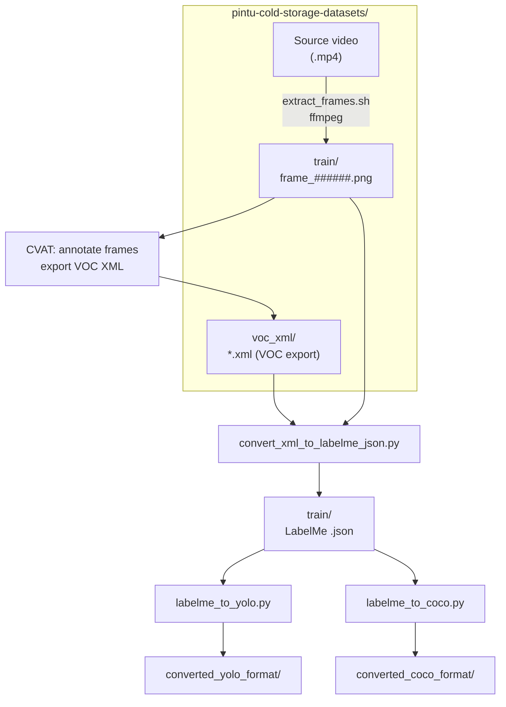

# pintu-cold-storage-labelling

Tools for the **cold storage door** dataset: extract frames from video, convert MIT LabelMe / Datumaro-style VOC XML to [wkentaro/labelme](https://github.com/wkentaro/labelme) JSON, then export **YOLO** or **COCO** for training.

All scripts assume a sibling folder **`pintu-cold-storage-datasets/`** (next to this `pintu-cold-storage-labelling/` directory) for inputs and outputs. Paths are resolved from the script location, so you can run them from any working directory.

## Prerequisites

- **Python 3** (shebangs use `python3`; on Windows use `py` or `python` as you prefer).
- **ffmpeg** in `PATH` (for frame extraction).
- **Bash** for `extract_frames.sh` (Git Bash, MSYS2, or WSL on Windows).

## Dataset layout (`pintu-cold-storage-datasets/`)

| Path | Role |
|------|------|
| `Video Pintu Cold Storage Terbuka Tertutup ada Tirainya.mp4` | Source video for frame extraction. |
| `voc_xml/` | Default folder for CVAT / VOC **`.xml`** exports (create it, or pass another directory as the `input` argument). |
| `train/` | Frames `frame_000000.png`, … plus LabelMe **`.json`** (same stem as image). XML→JSON conversion writes here by default. |
| `valid/`, `test/` | Optional splits for COCO export (same contents pattern as `train/`). |
| `converted_yolo_format/` | Written by `labelme_to_yolo.py`. |
| `converted_coco_format/` | Written by `labelme_to_coco.py`. |

Frame filenames use six digits to align with `<filename>` in VOC-style XML (e.g. `frame_000000.png`).

## Workflow

Pipeline overview (Mermaid renders on GitHub and in many Markdown previewers):



Run Python scripts from **`pintu-cold-storage-labelling/`** (or anywhere, using paths you pass).

### 1. Extract frames

Put the video in `pintu-cold-storage-datasets/` with the exact name above, then:

```bash
bash pintu-cold-storage-labelling/extract_frames.sh
```

Writes PNGs to `pintu-cold-storage-datasets/train/frame_%06d.png` (`-vsync passthrough` avoids dropping duplicated frames vs a strict VFR cap).

### 2. VOC / Datumaro XML → LabelMe JSON

Converts `<annotation>` XML to labelme-compatible JSON.

```bash
cd pintu-cold-storage-labelling

# Default: read all .xml under ../pintu-cold-storage-datasets/voc_xml/, write .json to ../pintu-cold-storage-datasets/train/
python convert_xml_to_labelme_json.py

# Explicit XML tree (e.g. CVAT export folder with another name)
python convert_xml_to_labelme_json.py ../pintu-cold-storage-datasets/train_xml_from_cvat_BACKUP

# Single file → default train/ folder
python convert_xml_to_labelme_json.py path/to/frame_000001.xml

# Custom output directory
python convert_xml_to_labelme_json.py ../pintu-cold-storage-datasets/voc_xml -o ../pintu-cold-storage-datasets/train

# Optional: embed image as base64
python convert_xml_to_labelme_json.py ../pintu-cold-storage-datasets/voc_xml --embed-image --image-root ../pintu-cold-storage-datasets/train
```

### 3a. LabelMe → YOLO (Ultralytics-style)

Defaults: `--train-dir` = `../pintu-cold-storage-datasets/train`, `--out-dir` = `../pintu-cold-storage-datasets/converted_yolo_format`.

```bash
python labelme_to_yolo.py
python labelme_to_yolo.py --train-dir ../pintu-cold-storage-datasets/train --out-dir ../pintu-cold-storage-datasets/converted_yolo_format
```

Output: `images/train/`, `labels/train/`, `data.yaml`, `classes.txt` under the chosen `--out-dir`.  
Shapes become **axis-aligned boxes** from their vertices (polygons included).

### 3b. LabelMe → COCO

Defaults: `--data-root` = `../pintu-cold-storage-datasets`, `--out-dir` = `../pintu-cold-storage-datasets/converted_coco_format`. Only split folders that exist among `train`, `valid`, `test` are processed (override with `--splits`).

```bash
python labelme_to_coco.py
python labelme_to_coco.py --data-root ../pintu-cold-storage-datasets --out-dir ../pintu-cold-storage-datasets/converted_coco_format --splits train valid test
```

Per split: `<out-dir>/<split>/_annotations.coco.json` plus copied images.  
Polygon shapes get COCO `segmentation`; others use empty segmentation with bbox only.

## Scripts

| Script | Purpose |
|--------|---------|
| `extract_frames.sh` | `ffmpeg` → `pintu-cold-storage-datasets/train/frame_######.png` |
| `convert_xml_to_labelme_json.py` | VOC/Datumaro XML → LabelMe JSON (default → `train/`) |
| `labelme_to_yolo.py` | `train/*.json` + images → YOLO layout under datasets |
| `labelme_to_coco.py` | `train` / `valid` / `test` under datasets → COCO |

## Notes

- **CVAT**: Export VOC XML into `pintu-cold-storage-datasets/voc_xml/` (or pass that folder path) so the default `python convert_xml_to_labelme_json.py` invocation finds files.
- **LabelMe GUI**: JSON matches labelme’s `LabelFile.write_label_file` shape.
- **Class IDs**: YOLO uses 0-based indices from sorted label names; COCO uses category ids `1 … K`.
