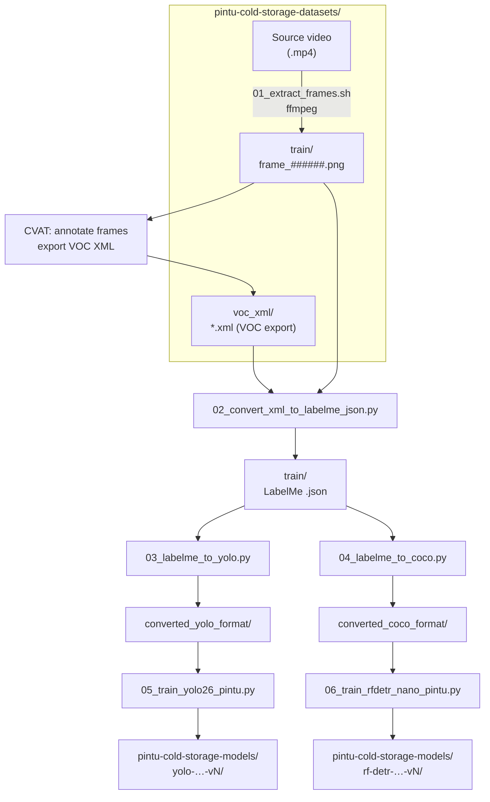

# pintu-cold-storage-labelling

Tools for the **cold storage door** dataset: extract frames from video, convert MIT LabelMe / Datumaro-style VOC XML to [wkentaro/labelme](https://github.com/wkentaro/labelme) JSON, then export **YOLO** or **COCO** for training.

All scripts assume a sibling folder **`pintu-cold-storage-datasets/`** (next to this `pintu-cold-storage-labelling/` directory) for inputs and outputs. Paths are resolved from the script location, so you can run them from any working directory.

## Prerequisites

- **Python 3** (shebangs use `python3`; on Windows use `py` or `python` as you prefer).
- **ffmpeg** in `PATH` (for frame extraction).
- **Bash** for `01_extract_frames.sh` (Git Bash, MSYS2, or WSL on Windows).

## Python dependencies (uv)

Always use **[uv](https://docs.astral.sh/uv/)** to create and maintain this project’s Python environment and lockfile—do not hand-edit `pyproject.toml` dependency lists or mix ad-hoc `pip install` for project deps.

| Task | Command |
|------|---------|
| New project / lockfile in this folder | `uv init` (once, if needed) |
| Add or upgrade a package | `uv add <package>` (e.g. `uv add ultralytics`) |
| Install from lockfile (CI, fresh clone) | `uv sync` |

Run scripts with `uv run python …` from `pintu-cold-storage-labelling/` so they use the synced environment.

## Dataset layout (`pintu-cold-storage-datasets/`)

| Path | Role |
|------|------|
| `Video Pintu Cold Storage Terbuka Tertutup ada Tirainya.mp4` | Source video for frame extraction. |
| `voc_xml/` | Default folder for CVAT / VOC **`.xml`** exports (create it, or pass another directory as the `input` argument). |
| `train/` | Frames `frame_000000.png`, … plus LabelMe **`.json`** (same stem as image). XML→JSON conversion writes here by default. |
| `valid/`, `test/` | Optional splits for COCO export (same contents pattern as `train/`). |
| `converted_yolo_format/` | Written by `03_labelme_to_yolo.py`. |
| `converted_coco_format/` | Written by `04_labelme_to_coco.py`. |

Sibling folder **`pintu-cold-storage-models/`** (next to `pintu-cold-storage-datasets/`) is created by the training scripts; each run gets its own dated subfolder (see [Train (YOLO26n / RF-DETR Nano)](#4-train-yolo26n--rf-detr-nano)).

Frame filenames use six digits to align with `<filename>` in VOC-style XML (e.g. `frame_000000.png`).

## Workflow

Pipeline overview (Mermaid renders on GitHub and in many Markdown previewers):



Run Python scripts from **`pintu-cold-storage-labelling/`** (or anywhere, using paths you pass).

### 1. Extract frames

Put the video in `pintu-cold-storage-datasets/` with the exact name above, then:

```bash
bash pintu-cold-storage-labelling/01_extract_frames.sh
```

Writes PNGs to `pintu-cold-storage-datasets/train/frame_%06d.png` (`-vsync passthrough` avoids dropping duplicated frames vs a strict VFR cap).

### 2. VOC / Datumaro XML → LabelMe JSON

Converts `<annotation>` XML to labelme-compatible JSON.

```bash
cd pintu-cold-storage-labelling

# Default: read all .xml under ../pintu-cold-storage-datasets/voc_xml/, write .json to ../pintu-cold-storage-datasets/train/
python 02_convert_xml_to_labelme_json.py

# Explicit XML tree (e.g. CVAT export folder with another name)
python 02_convert_xml_to_labelme_json.py ../pintu-cold-storage-datasets/train_xml_from_cvat_BACKUP

# Single file → default train/ folder
python 02_convert_xml_to_labelme_json.py path/to/frame_000001.xml

# Custom output directory
python 02_convert_xml_to_labelme_json.py ../pintu-cold-storage-datasets/voc_xml -o ../pintu-cold-storage-datasets/train

# Optional: embed image as base64
python 02_convert_xml_to_labelme_json.py ../pintu-cold-storage-datasets/voc_xml --embed-image --image-root ../pintu-cold-storage-datasets/train
```

### 3a. LabelMe → YOLO (Ultralytics-style)

Defaults: `--train-dir` = `../pintu-cold-storage-datasets/train`, `--out-dir` = `../pintu-cold-storage-datasets/converted_yolo_format`.

```bash
python 03_labelme_to_yolo.py
python 03_labelme_to_yolo.py --train-dir ../pintu-cold-storage-datasets/train --out-dir ../pintu-cold-storage-datasets/converted_yolo_format
```

Output: `images/train/`, `labels/train/`, `data.yaml`, `classes.txt` under the chosen `--out-dir`.  
Shapes become **axis-aligned boxes** from their vertices (polygons included).

### 3b. LabelMe → COCO

Defaults: `--data-root` = `../pintu-cold-storage-datasets`, `--out-dir` = `../pintu-cold-storage-datasets/converted_coco_format`. Only split folders that exist among `train`, `valid`, `test` are processed (override with `--splits`).

```bash
python 04_labelme_to_coco.py
python 04_labelme_to_coco.py --data-root ../pintu-cold-storage-datasets --out-dir ../pintu-cold-storage-datasets/converted_coco_format --splits train valid test
```

Per split: `<out-dir>/<split>/_annotations.coco.json` plus copied images.  
Polygon shapes get COCO `segmentation`; others use empty segmentation with bbox only.

### 4. Train (YOLO26n / RF-DETR Nano)

#### Prerequisites

1. **Environment:** From `pintu-cold-storage-labelling/`, run `uv sync` so `ultralytics` and `rfdetr` (see `pyproject.toml`) are installed. Use `uv run python …` for training so the project venv is used.
2. **YOLO path:** Run [LabelMe → YOLO](#3a-labelme--yolo-ultralytics-style) so `pintu-cold-storage-datasets/converted_yolo_format/data.yaml` exists.
3. **RF-DETR path:** Run [LabelMe → COCO](#3b-labelme--coco) with splits that include **`valid`** (not only `train`). RF-DETR expects Roboflow-style folders:
   - `converted_coco_format/train/_annotations.coco.json` (+ images)
   - `converted_coco_format/valid/_annotations.coco.json` (+ images)
   - Optional: `converted_coco_format/test/_annotations.coco.json` — if missing, the script disables per-epoch test evaluation (validation still runs).

#### Run directory naming

Both scripts write under sibling **`pintu-cold-storage-models/`** (resolved from the repo root, same level as `pintu-cold-storage-datasets/`). Each run uses a subfolder:

- **Auto (default):** `{kind}-{YYYY-MM-DD}-vN` where `kind` is `yolo` or `rf-detr`, and `vN` increments per day by scanning existing siblings (`v1`, `v2`, …) so same-day reruns do not overwrite.
- **Fixed:** Pass `--run-name my-exp` to use `pintu-cold-storage-models/my-exp/` (create/resume explicitly).

Every run always writes:

| Artifact | Description |
|----------|-------------|
| `train.log` | Full tee of stdout and stderr (append mode if the file already exists). |
| `run_meta.json` | CLI args, start/end timestamps, duration, Python/platform, `cwd`, `status`, and extra fields (e.g. dataset path). |

Example layout (auto-named runs; framework-specific files appear inside each folder):

```
pintu-cold-storage-models/
  yolo-2026-05-08-v1/
    train.log
    run_meta.json
    weights/best.pt
    weights/last.pt
    results.csv
    args.yaml
  yolo-2026-05-08-v2/          # same calendar day → v2, v3, …
  rf-detr-2026-05-08-v1/
    train.log
    run_meta.json
    checkpoint.pth
    log.txt
    …                            # plus TensorBoard events if enabled
```

---

#### 4a. YOLO26n — `05_train_yolo26_pintu.py`

**Input:** `data.yaml` (default: `pintu-cold-storage-datasets/converted_yolo_format/data.yaml` from repo root).

**Steps:**

```bash
cd pintu-cold-storage-labelling
uv sync
uv run python 05_train_yolo26_pintu.py
```

**Example overrides:**

```bash
# Custom data file or shorter run
uv run python 05_train_yolo26_pintu.py --data ../pintu-cold-storage-datasets/converted_yolo_format/data.yaml --epochs 50 --batch 8

# GPU selection (Ultralytics convention)
uv run python 05_train_yolo26_pintu.py --device 0

# Resume last checkpoint in a fixed folder (create the same --run-name as before)
uv run python 05_train_yolo26_pintu.py --run-name yolo-2026-05-08-v1 --resume
```

| Flag | Default | Purpose |
|------|---------|---------|
| `--data` | `…/converted_yolo_format/data.yaml` | YOLO dataset manifest. |
| `--model` | `yolo26n.pt` | Ultralytics pretrained weights or model YAML. |
| `--epochs` | `100` | Training epochs. |
| `--imgsz` | `640` | Image size. |
| `--batch` | `16` | Batch size (`-1` = auto). |
| `--device` | _(auto)_ | e.g. `0`, `cpu`, `0,1`. |
| `--workers` | `8` | DataLoader workers. |
| `--patience` | `50` | Early stopping patience (epochs). |
| `--seed` | `0` | RNG seed. |
| `--resume` | off | Resume interrupted training (pair with `--run-name` for a stable folder). |
| `--amp` / `--no-amp` | `--amp` | Automatic mixed precision. |
| `--models-dir` | `../pintu-cold-storage-models` | Root for run directories. |
| `--run-name` | _(auto `yolo-YYYY-MM-DD-vN`)_ | Subfolder under `--models-dir`. |

**Outputs** (under `pintu-cold-storage-models/<run>/`; Ultralytics uses `project` + `name` = that folder):

- **`train.log`**, **`run_meta.json`** (see above).
- **`weights/best.pt`**, **`weights/last.pt`** — best and last checkpoints.
- **`results.csv`**, **`args.yaml`** — per-epoch metrics and resolved training args.
- **Plots / exports** Ultralytics may add during training (e.g. confusion matrix, PR curves, labels) in the same run directory.

**Note:** If `data.yaml` points validation at the same folder as train, metrics are optimistic; for honest validation, split images into `images/val` (and matching `labels/val`) and update `val:` in `data.yaml`.

---

#### 4b. RF-DETR Nano — `06_train_rfdetr_nano_pintu.py`

**Input:** COCO root (default: `pintu-cold-storage-datasets/converted_coco_format`) with `train/` and **`valid/`** splits as above.

**Steps:**

```bash
cd pintu-cold-storage-labelling
uv sync
uv run python 06_train_rfdetr_nano_pintu.py
```

**Example overrides:**

```bash
uv run python 06_train_rfdetr_nano_pintu.py --epochs 50 --batch-size 2 --device cuda:0 --num-workers 0

# Resume from a checkpoint path
uv run python 06_train_rfdetr_nano_pintu.py --resume path/to/checkpoint.pth --run-name rf-detr-2026-05-08-v1

# No test split in dataset: disable test eval explicitly
uv run python 06_train_rfdetr_nano_pintu.py --no-run-test
```

Optional logging extras: `uv add "rfdetr[metrics]"` for richer TensorBoard / W&B integration (see script docstring).

| Flag | Default | Purpose |
|------|---------|---------|
| `--dataset-dir` | `…/converted_coco_format` | Root with `train/`, `valid/`[, `test/`]. |
| `--epochs` | `100` | Training epochs. |
| `--batch-size` | `4` | Per-step batch. |
| `--grad-accum-steps` | `4` | Gradient accumulation (effective batch scales with this). |
| `--lr` | `1e-4` | Learning rate. |
| `--device` | `cuda` | `cuda`, `cpu`, or `cuda:0`. |
| `--num-workers` | `0` | DataLoader workers (`0` is safest on Windows). |
| `--resume` | _(none)_ | Path to `checkpoint.pth` to continue training. |
| `--early-stopping` | off | Enable early stopping. |
| `--early-stopping-patience` | `10` | Patience when early stopping is on. |
| `--run-test` / `--no-run-test` | `--run-test` | Run test evaluation each epoch if `test/_annotations.coco.json` exists. |
| `--tensorboard` / `--no-tensorboard` | `--tensorboard` | TensorBoard logging. |
| `--wandb` | off | Weights & Biases (set `--wandb-project` / `--wandb-run` when enabled). |
| `--checkpoint-interval` | `10` | Save checkpoints every N epochs. |
| `--models-dir` | `../pintu-cold-storage-models` | Root for run directories. |
| `--run-name` | _(auto `rf-detr-YYYY-MM-DD-vN`)_ | Subfolder under `--models-dir`. |

**Outputs** (under `pintu-cold-storage-models/<run>/`):

- **`train.log`**, **`run_meta.json`** (see above).
- **RF-DETR artifacts** — typically including training logs and checkpoints (e.g. `checkpoint.pth`, `log.txt`); exact filenames follow the `rfdetr` library version.
- **TensorBoard** — if enabled, event files under the run directory (point TensorBoard at the run folder to browse).

## Scripts

| Script | Purpose |
|--------|---------|
| `01_extract_frames.sh` | `ffmpeg` → `pintu-cold-storage-datasets/train/frame_######.png` |
| `02_convert_xml_to_labelme_json.py` | VOC/Datumaro XML → LabelMe JSON (default → `train/`) |
| `03_labelme_to_yolo.py` | `train/*.json` + images → YOLO layout under datasets |
| `04_labelme_to_coco.py` | `train` / `valid` / `test` under datasets → COCO |
| `05_train_yolo26_pintu.py` | Fine-tune Ultralytics YOLO26n → `pintu-cold-storage-models/yolo-YYYY-MM-DD-vN/` |
| `06_train_rfdetr_nano_pintu.py` | Fine-tune RF-DETR Nano → `pintu-cold-storage-models/rf-detr-YYYY-MM-DD-vN/` |

## Notes

- **CVAT**: Export VOC XML into `pintu-cold-storage-datasets/voc_xml/` (or pass that folder path) so the default `python 02_convert_xml_to_labelme_json.py` invocation finds files.
- **LabelMe GUI**: JSON matches labelme’s `LabelFile.write_label_file` shape.
- **Class IDs**: YOLO uses 0-based indices from sorted label names; COCO uses category ids `1 … K`.
